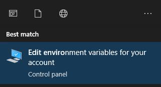
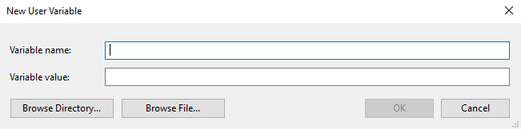
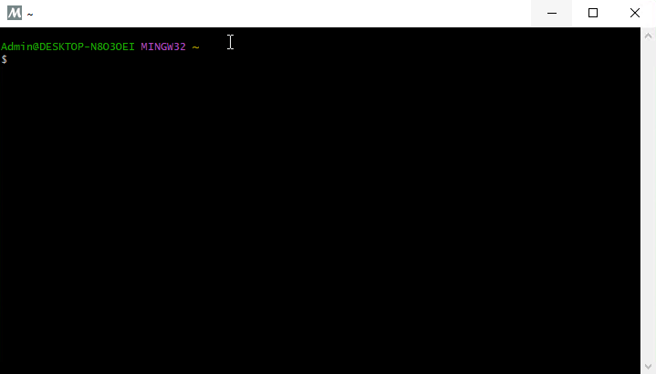
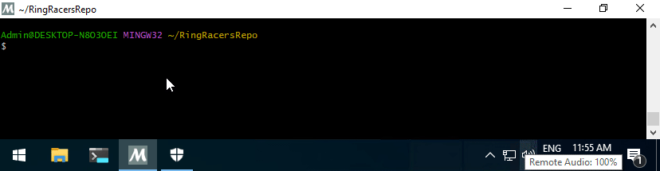

# How to compile [Dr. Robotnik's Ring Racers](https://www.kartkrew.org/) for Windows

> <small>:information_source: This guide is intended for Windows 10 x64, but should also apply for Windows 11.</small>

:warning: Your **Windows Defender** may be triggered when building the game.
<small>
> This might happen because of certain files being generated during the compilation process.\
> If this _does_ happen, you can safely allow the actions.
</small>

The following programs are required to proceed:
- [Git for Windows](https://git-scm.com/)
- [vcpkg](https://vcpkg.io/en/)
- [MSYS2](https://www.msys2.org/)

If these programs aren't installed, start with the **Prerequisites** section.\
Otherwise, proceed directly to the **Compiling** section.

---

<details>
    <summary>
        <h3 style="margin-top: 0 !important; margin-bottom: 0 !important">Prerequisites</h3>
    </summary>

### 1. Set up environment variables
> One of the required packages, **MSYS2**, uses the `$HOME` environment variable. \
> To follow this guide accurately, you need to ensure that this variable exists on your system.

- Search for 'environment variables' in the Start Menu and select '**Edit environment variables for your account**':
  
  

  This will open the **Environment Variables** window, where you'll see the existing system environment variables.\
  Focus on the '**User variables**' section.

  

  If the `HOME` variable is already present, proceed to the [next step](#2-install-git).\
  If _not_, continue reading.

- Click on the `New...` button. This will open a `New User Variable` window:
  
  

  Add the `HOME` variable by filling out the form, as shown below:
  | Variable name: | HOME |
  | --- | --- |
  | **Variable value**: | C:\\Users\\\<your username>

  

  Replace `<your username>` with your actual username.\
  Click `OK` on the bottom-right when you're finished.

- The `HOME` variable should be visible in  '**User variables**' section.
  
  
  Click `OK` on the bottom-right to close the '**Environment Variables** window.

    ---
    <small>If you're unsure, refer to the following video:</small>
    > <details><summary>Adding the HOME environment variable</summary><video src="./assets/vmconnect_Jeer1a5fPc.mp4" controls></details>

### 2. Install _Git_

- Download [**Git for Windows**](https://git-scm.com/downloads/win).
    > <small>32-bit or 64-bit, depending on [**your operating system**](https://support.microsoft.com/en-gb/windows/32-bit-and-64-bit-windows-frequently-asked-questions-c6ca9541-8dce-4d48-0415-94a3faa2e13d).</small>

- Follow each step in the setup wizard _as instructed_.
    > Leave each option set to its default value.

- <a id="open-powershell"></a>Open   Windows PowerShell by searching for it in the Start Menu.

    <small>If you're unsure, refer to the following video:</small>
    > <details><summary>Opening Windows PowerShell</summary><video src="./assets/vmconnect_dmSnbCnu2M.mp4" controls></details>

- Check if **Git** has been installed by running the following command in the terminal:
    ```powershell
    git --version
    ```
    If successful, you should see a message like this in your terminal:

    

    Keep this terminal **_open_** for the [next step](#3-install-vcpckg).

### 3. Install _vcpckg_

- At this point, a PowerShell terminal should be open, defaulting to your home directory (`C:\Users\<your username>`), as shown here:

    

    
    > <small>If you _haven't_ got  Windows PowerShell open, follow [these instructions](#open-powershell).</small>

    
- Clone the **vcpkg** repository into a folder of your choice using **Git**, by running the following command in your terminal:

    ```bash
    git clone https://github.com/microsoft/vcpkg.git
    ```

    This will create a folder in your home directory named `vcpkg`, therefore, the full path of the repository should be:

    ```powershell
    C:\Users\<your username>\vcpkg
    ```
- Navigate to the newly-created `vcpkg` folder and run the bootstrap script:

    ```bash
    cd vcpkg; .\bootstrap-vcpkg.bat
    ```

- Check if **vcpkg** has been installed by running the following command:

    ```bash
    .\vcpkg --version
    ```

    If successful, the terminal will display the version of `vcpkg` that has been installed:

    

    ---
    <small>If you're unsure, refer to the following video:</small>
    > <details><summary>Installing <strong>vcpkg</strong></summary><video src="./assets/vmconnect_H2wqoaJ797.mp4" controls></details>

### 4. Install _MSYS2_

- Download [the MSYS2 installer](https://www.msys2.org/).

- Follow each step in the setup wizard _as instructed._
    > Leave each option set to its default value.

- Once installation completes, a terminal window will open. This confirms that **MSYS2** was installed succesfully.

      

    You may now close this window and proceed to the [Compiling](#compiling-time) instructions.

    ---
    <small>If you're unsure, refer to the following video:</small>
    > <details><summary>Installing <strong>MSYS2</strong></summary><video src="./assets/vmconnect_M3QC8g8tcl.mp4" controls></details>
</details>

<details>
    <summary>
        <a id="compiling-time"></a><h3 style="margin-top: 0 !important; margin-bottom: 1!important">Compiling</h3>
    </summary>

### 1. Opening _MSYS2_

> :information_source: Copy (Ctrl+C) and paste (Ctrl+V) shortcuts do not work inside MSYS2 shells. You _can_ still right-click to copy and paste.

- Using  File Explorer, navigate to the default MSYS2 installation folder: `C:\msys64`.

- Open the **MINGW32** shell (`mingw32.exe`), as denoted by the  icon.
    > <small> The MINGW32 shell is a **terminal** provided by MSYS2.</small> 

    

    Like PowerShell, this terminal opens in your home directory by default (`C:\Users\<your username>`).\
    As represented by the tilde symbol (`~`).
    
    ---
    <small>If you're unsure, refer to the following video:</small>
    > <details><summary>Opening the <strong>MINGW32</strong> shell</summary><video src="./assets/vmconnect_S8GI4PlHyD.mp4" controls></details>

### 2. Updating the package database

- Update the package database and all installed packages by running the following command in the shell:

    ```bash
    pacman -Syu
    ```

    

    When prompted with ```Proceed with installation? [Y/n]```, ype `Y` in the terminal and press `Enter`.

- After updating, you _might_ see a message prompting you to **close** the terminal window, like this:

    ```
    To complete this update all MSYS2 processes including this terminal will be closed. Confirm to proceed [Y/n]
    ```
    If you _don't_ see this message, continue to the [next step](#3-installing-the-required-packages).

    If you _do_, type `Y` in the terminal and press `Enter`.\
    To open the terminal window again, follow the instructions in [step 1](#1-opening-msys2).

### 3. Installing the required packages
- In the **MINGW32** shell, execute the following command to install all the required packages:

    ```bash
    pacman -S make git mingw-w64-i686-gcc mingw-w64-i686-ninja mingw-w64-i686-cmake
    ```

    

    When prompted with: 
    
    ```
    Proceed with installation? [Y/n]
    ```
    Type `Y` in the terminal and press `Enter`.\
    Wait for the packages to finish downloading.

- To verify that all the required packages have been installed sucessfully, run the follow command in the terminal:

    ```bash
    which ninja make cmake gcc g++ git
    ```

    If the packages _have_ been installed succesfully, each command will return the path to its respective executable:

    

    Keep this terminal **_open_** for the [next step](#4-downloading-the-games-source-code).

### 4. Downloading the game's source code

> <small>:information_source: For demonstration purposes, this guide will use the _latest_ version of Dr. Robotnik's Ring Racers. As of **January 1st 2025**, that is <strong>[v2.3](https://github.com/KartKrewDev/RingRacers/tree/v2.3).</strong> </small>

- Verify that the terminal is in your home directory by running the following command:

    ```
    cd $HOME
    ```
    

    > <small>The tilde symbol (~) represents your home directory.</small>

- Clone the repository for _Ring Racers_, with the following command:

    ```bash
    git clone https://github.com/KartKrewDev/RingRacers.git RingRacersRepo
    ```

    This will create a new folder in your home directory named `RingRacersRepo`, which will contain the game's source code.

    ---
    <small>If you're unsure, refer to the following video:</small>
    > <details><summary>Cloning the repository</summary><video src="./assets/vmconnect_FfnfEAf3XK.mp4" controls></details>

- <a id="ringracers-repo-inst"></a>Navigate to the new `RingRacersRepo` folder by running the command:

    ```bash
    cd RingRacersRepo
    ```
    
- Switch the current branch to **v2.3** with the following command:
    ```bash
    git checkout v2.3
    ```
    > <small>If you encounter any errors when running this command, make _sure_ that you're in the `RingRacersRepo` folder.\
    > Refer to the [previous](#ringracers-repo-inst) step for instructions. </small>
- Verify that your branch is set to **v2.3**, by running:

    ```bash
    git branch
    ```

    You will see an asterisk (*) next to the current branch, which should say `(HEAD detached at v2.3)`.

    

    Keep this terminal **_open_** for the [next step](#5-configuring-the-game-for-compilation).


### 5. Configuring the game for compilation
- Set the `VCPKG_ROOT` environment variable by running the following:<sup>:star:</sup>

    ```bash
    export VCPKG_ROOT="$HOME/vcpkg"
    ```

- Configure the game for building with this command: 

    ```bash
    cmake --preset ninja-x86_mingw_static_vcpkg-release
    ```

    `cmake` will begin configuriation and grab *all* the required dependecies needed to compile the game via `vcpkg`.

    

    Since this is your first time running the configuration, it may take some time, so be patient.\
    Future configurations will be faster.

- If configuration completes successfully, you _should_ see messages in the terminal like this:

    ```bash
    -- Configuring done (376.5s)
    -- Generating done (0.3s)
    -- Build files have been written to: C:/Users/<your username>/RingRacersRepo/build/ninja-x86_mingw_static_vcpkg-release
    ```

    Keep this terminal **_open_** for the [next step](#6-compiling-the-game).

    ---
    <sup>:star:</sup> <small>To avoid having to do this **all** the time, you can set `VCPKG_ROOT` as an environment variable _permanently_ with the following command:

    ```bash
    echo 'export VCPKG_ROOT="$HOME/vcpkg"' >> ~/.bashrc
    ```

    
    </small>

### 6. Compiling the game

- To begin compiling, run the following command in the terminal:

    ```bash
    cmake --build --preset ninja-x86_mingw_static_vcpkg-release
    ```

    `cmake` will finally begin the build process, compiling the source files required to build the game's executable.\
    Depending on your computer's hardware, this can either be quick or take some time.


    ---
    <small>If you're unsure, refer to the following video:</small>
    > <details><summary>Compiling the game with cmake</summary><video src="./assets/vmconnect_YAcevjsnFl.mp4" controls></details>


- If the game has succesfully compiled, you should see a message in the terminal similar to this:

    ```bash
    [475/475] Linking CXX executable bin\ringracers_v2.3.exe
    ```

    This line confirms that the build process has completed and the executable has been succesfully created.

- The executable can be found in the `build` directory: 

    ```
    build/ninja-x86_mingw_static_vcpkg-release/bin
    ```

    

    This path is relative to the `RingRacers` directory. The terminal opens in your home directory by default (`C:/Users/<your username>`).\
    Therefore, the full path to your compiled game would be:
    ```
    C:\Users\<your username>\RingRacersRepo\build\ninja-x86_mingw_static_vcpkg-release\bin\ringracers_v2.3.exe
    ```

    

- To run the executable, you need to copy it to the folder where you've already installed Dr. Robotnik's Ring Racers.
</details>
